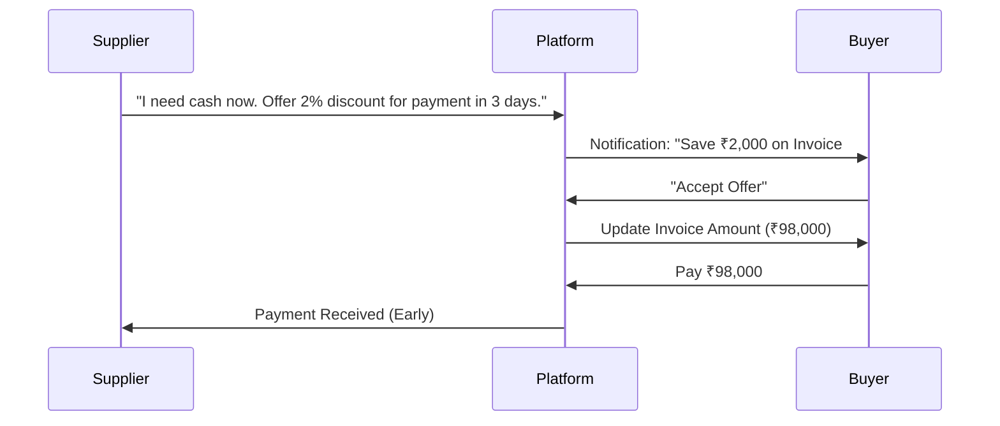

# Dynamic Discounting Specification
## Module 07: Financing & Factoring

**Version:** 1.0
**Date:** November 23, 2025
**Status:** Draft

---

## 1. Executive Summary
Dynamic Discounting (Reverse Factoring) allows Suppliers to offer Buyers a discount for early payment. Unlike traditional factoring (which involves a bank), this is a direct negotiation between Buyer and Supplier. It optimizes working capital for both: Suppliers get cash faster (cheaper than a loan), and Buyers get a risk-free return on their idle cash.

## 2. Strategic Objectives
1.  **Working Capital Optimization**: Unlock cash trapped in 30-90 day payment terms.
2.  **Buyer-Led Liquidity**: Leverage the Buyer's balance sheet to fund the Supplier.
3.  **Automated Negotiation**: Eliminate back-and-forth emails for discount agreements.

## 3. Architecture & Technology Stack

### 3.1 Technology Choices
*   **Engine**: NestJS-based **Discount Calculator** using sliding scale logic (APR based).
*   **Workflow**: State machine in Module 05 (Milestone Workflows) to handle Offer -> Accept -> Pay transitions.
*   **Notification**: Real-time alerts via Module 11 (WhatsApp/Email).

### 3.2 Discount Workflow

## 4. Key Features & Specifications

### 4.1 The "Get Paid Early" Button
*   **UI**: Prominent button on the Invoice Detail view for Suppliers.
*   **Configuration**:
    *   **Fixed Discount**: "2% flat off".
    *   **Dynamic Sliding Scale**: "18% APR pro-rated" (The earlier you pay, the higher the discount).
    *   **Minimum Amount**: "Only accept if paid within 5 days".

### 4.2 Buyer Offer Interface
*   **UI**: "Savings Opportunity" dashboard for Buyers.
*   **Action**: One-click "Accept & Pay".
*   **Auto-Accept**: Buyers can set rules (e.g., "Always accept >20% APR offers").

### 4.3 Credit Note Automation
*   **Accounting**: When a discount is accepted, the system must automatically:
    1.  Generate a **Credit Note** for the discount amount.
    2.  Link it to the original Invoice.
    3.  Update the "Amount Due" to the discounted total.
    4.  Sync with GST (Module 01) to adjust tax liability if applicable.

## 5. Implementation Tasks

### Phase 1: The Engine (Week 1-3)
- [ ] **Discount Logic**: Implement `DiscountService` in Module 07 to calculate APR-based discounts.
- [ ] **Offer Model**: Create database schema for `DiscountOffer` (linked to Invoice).
- [ ] **API Endpoints**: `createOffer`, `acceptOffer`, `rejectOffer`.

### Phase 2: User Interface (Week 4-5)
- [ ] **Supplier UI**: "Boost Cash Flow" widget showing potential cost of discount vs. waiting.
- [ ] **Buyer UI**: "Treasury Dashboard" showing potential savings from early payments.

### Phase 3: Financial Compliance (Week 6-8)
- [ ] **Credit Note Gen**: Auto-generate GST-compliant credit notes upon payment.
- [ ] **Ledger Sync**: Ensure accounting entries reflect the discount expense/income correctly.

## 6. Success Metrics
*   **Adoption Rate**: % of Suppliers creating discount offers.
*   **Acceptance Rate**: % of offers accepted by Buyers.
*   **DSO Reduction**: Reduction in Days Sales Outstanding for active users.
*   **Savings Generated**: Total amount saved by Buyers / Liquidity provided to Suppliers.
