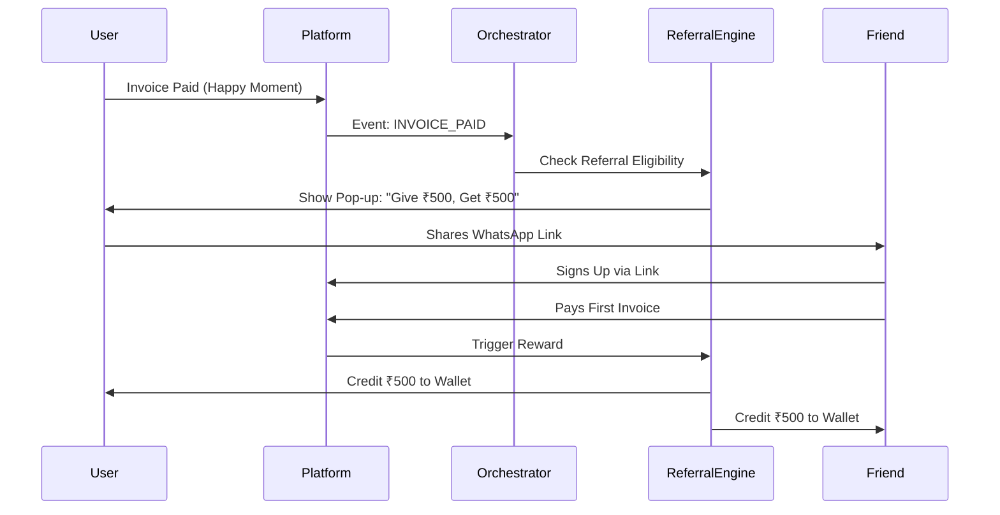

# Context-Aware Referral Engine Specification
## Module 09: Marketing & Customer Success

**Version:** 1.0
**Date:** November 23, 2025
**Status:** Draft

---

## 1. Executive Summary
Traditional "Invite a Friend" buttons are ignored. A **Context-Aware Referral Engine** waits for "Happy Moments"—specific points in the user journey where trust and satisfaction are at their peak—to ask for a referral. This specification defines the triggers, reward schemes, and architecture to operationalize word-of-mouth growth.

## 2. Strategic Objectives
1.  **High-Conversion Asks**: Only ask when the user is winning.
2.  **Viral Loop**: Turn every success story into a new user acquisition.
3.  **Low CAC**: Acquire users at a fraction of paid marketing costs.

## 3. Global Best Practices Applied
Based on successful B2B/Fintech referral models (Dropbox, PayPal, Brex):
1.  **Double-Sided Rewards**: "You get ₹500, They get ₹500" (Altruism + Self-interest).
2.  **Milestone Unlocking**: "Refer 3 friends to unlock Free Instant Transfers for a month" (Gamification).
3.  **Partner Program**: "Refer your clients" (For CAs/Accountants) with recurring revenue share.

## 4. "Happy Moment" Triggers (The "When")

The **Orchestration Hub (Module 10)** will monitor these events to trigger the ask:

| User Role | Happy Moment Event | Trigger Context | The Ask (Copy) |
| :--- | :--- | :--- | :--- |
| **Supplier** | **Invoice Paid Early** | Payment received < 30 days | "Got paid fast? Help your network do the same. Invite a friend." |
| **Supplier** | **Loan Disbursed** | Cash hits the bank | "Cash flow problem solved? Share the relief with a business partner." |
| **Supplier** | **Dispute Won** | Legal resolution successful | "Impressed by our legal support? Refer a friend facing payment issues." |
| **Buyer** | **Discount Secured** | Dynamic Discount accepted | "Saved ₹2,000! Invite your other suppliers to offer you discounts." |
| **User** | **Credit Score Up** | Score crosses 750 | "You're a top-tier business! Invite peers to join the trusted network." |

## 5. Reward Schemes (The "What")

### 5.1 The "Cash Flow" Scheme (Default)
*   **Offer**: ₹500 Wallet Credit for both Referrer and Referee.
*   **Condition**: Referee must send/pay their first invoice > ₹10,000.
*   **Why**: Cash is the biggest motivator for SMEs.

### 5.2 The "Power User" Scheme (Gamified)
*   **Offer**: Unlock "AI Predictions" or "0% Transaction Fee" for 1 month.
*   **Condition**: Refer 3 active businesses.
*   **Why**: Appeals to high-volume users who value features over small cash.

### 5.3 The "CA/Partner" Scheme (Recurring)
*   **Offer**: 10% of subscription revenue for 1 year.
*   **Condition**: Registered Partner refers a client.
*   **Why**: Incentivizes accountants to onboard their entire book of business.

## 6. Architecture & Technology Stack

### 6.1 Technology Choices
*   **Engine**: Module 09 (Marketing) `ReferralService`.
*   **Event Bus**: RabbitMQ (Module 10) to listen for "Happy Events".
*   **Payouts**: Module 03 (Payment) `WalletService` for instant crediting.
*   **Links**: Firebase Dynamic Links or custom deep links for attribution.

### 6.2 Referral Flow

## 7. Implementation Tasks

### Phase 1: The Engine (Week 1-2)
- [ ] **Referral Codes**: Generate unique alphanumeric codes for every user (`User.referralCode`).
- [ ] **Attribution System**: Logic to track `signup(referralCode)` and link users.
- [ ] **Reward Ledger**: Table to track `Pending`, `Earned`, and `Paid` rewards.

### Phase 2: The Triggers (Week 3-4)
- [ ] **Event Listeners**: Subscribe to `INVOICE_PAID`, `LOAN_DISBURSED` events in Module 10.
- [ ] **Contextual UI**: "Toast" notifications or "Confetti" modals triggered by these events.
- [ ] **WhatsApp Share**: Pre-filled WhatsApp message: "I use [Platform] to get paid 30% faster. Use my link for ₹500: [Link]".

### Phase 3: Payouts (Week 5)
- [ ] **Wallet Integration**: Auto-credit Module 03 Wallets upon successful conversion.
- [ ] **Anti-Fraud**: Basic checks (same IP, same device, circular referencing).

## 8. Success Metrics
*   **Viral Coefficient**: > 0.2 (Organic growth).
*   **Conversion Rate**: % of invites that result in active users.
*   **CAC Savings**: Difference between Paid CAC and Referral CAC (Reward Cost).
